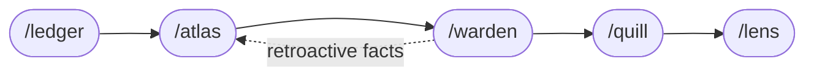

# Writer's PKM for Obsidian

A personal knowledge management setup for creative writers, built around an Obsidian vault and a pipeline of Claude Code skills that help keep long-form fiction consistent, well-edited, and readable.

If you write novels or short stories — especially across multiple projects or a shared universe — this gives you a ready-made vault layout, a place to stash ideas, and five editorial agents that know how to work together.

> **New here?** Read **[USAGE.md](USAGE.md)** — the writer's handbook. It walks through your first session, every skill, every convention, and recipes for common situations.

## What's inside

| Path | Purpose |
|---|---|
| `Obsidian/Working Title/` | The Obsidian vault. Rename the folder to whatever you like. |
| `Obsidian/Working Title/00_Scratchpad/` | Raw ideas and story fragments (`Ideas/`, `Fragments/`). Fragments are prefixed with `SS_`. Nothing here is canon yet. |
| `Obsidian/Working Title/01_Projects/` | Active writing projects. Each novel or story collection gets its own subfolder. Each novel gets a `Lore/` subfolder. |
| `Obsidian/Working Title/01_Projects/Example - A City That Forgets/` | Worked example: a 3-chapter short story with populated Atlas, Lore notes, and sample Warden / Quill / Lens reports. Read it to see what the framework produces in practice. |
| `Obsidian/Working Title/02_Research/` | Research notes that feed any project. |
| `_skill-sources/` | Editable source for the writing skills (one folder per skill, each with a `SKILL.md`). |
| `*.skill` | Packaged (zipped) distributable versions of each skill, rebuilt from the sources. |
| `templates/` | Optional-everything stub files (`_meta/`, `Lore/` notes) that `/new-project` copies when scaffolding a new project. |
| `Makefile` | One-liner installer (`make install`) and archive packager (`make package`). Run `make help` to see every target. |
| `CLAUDE.md` | Instructions Claude Code reads at the start of every session — vault conventions and where you personalize voice/language preferences. |
| `USAGE.md` | Writer's handbook. Detailed walkthrough for an amateur user — every skill, every convention, recipes for common situations. |

## The skill pipeline

Five Claude Code skills, each with a specific role in the editorial pipeline. Invoke them with `/skillname`.



Atlas is the source of truth — Warden, Quill, and Lens all read from it. Warden's retroactive findings flow back to Atlas on the next run.

| Skill | Command | Role |
|---|---|---|
| **Ledger** | `/ledger` | Session entry point — scans for changes since last run, maintains `status.md` per project, can orchestrate the whole pipeline |
| **Atlas** | `/atlas` | Living story map — characters, locations, active threads, world rules, retroactive facts |
| **Warden** | `/warden` | Consistency checker — continuity, lore, timeline, retroactive impact |
| **Quill** | `/quill` | Prose editor — grammar, voice, vocabulary, rhythm, show-don't-tell |
| **Lens** | `/lens` | Fresh reader — clarity, pacing, emotional landing, what a first-time reader actually experiences |

**Pipeline order:** Ledger → Atlas (once per project) → Warden → Quill → Lens (per file).

A sixth skill sits outside the pipeline:

| Skill | Command | Role |
|---|---|---|
| **New Project** | `/new-project` | Scaffolds a fresh project under `01_Projects/` from `templates/` — asks for title and type, creates `_meta/` (and `Lore/` for novels and collections), then hands off to `/atlas`. No prose, no plot — just folders. |

### How they fit together

- **Atlas** is the source of truth. Warden, Quill, and Lens all read from `_meta/atlas.md`.
- **Warden** reports inconsistencies against Atlas. Retroactive facts it detects get queued back to Atlas.
- **Quill** never touches plot or continuity. It's strictly prose-level.
- **Lens** deliberately doesn't read lore or Atlas as a source — only as a table of contents. It represents the reader.
- **Ledger** tracks which files have been reviewed by which agent and when, so you know what's pending.

Each project has a `_meta/` subfolder where all four non-Ledger skills write their outputs (e.g. `_meta/warden/Chapter_03_warden.md`). Ledger owns `_meta/status.md`.

## Install

1. **Clone or generate from this repo.**
   ```bash
   git clone https://github.com/<you>/writers-pkm-obsidian-vault.git
   cd writers-pkm-obsidian-vault
   ```

2. **Open the vault in Obsidian.** Point Obsidian at `Obsidian/Working Title/` (or rename that folder first). The vault comes with sensible core plugins enabled and a few community plugins declared — Obsidian will prompt you to install them on first open.

3. **Install the skills into Claude Code.** Each skill is a folder under `_skill-sources/` containing a `SKILL.md`. The fastest path is the bundled Makefile:

   ```bash
   make install
   ```

   That copies all six skill folders into `~/.claude/skills/`, replacing any previous copy. Override the destination with `make install SKILLS_DIR=/some/other/path`. Restart Claude Code so it picks them up.

   If you'd rather not use `make`, the manual equivalent:

   ```bash
   mkdir -p ~/.claude/skills
   cp -r _skill-sources/ledger       ~/.claude/skills/
   cp -r _skill-sources/atlas        ~/.claude/skills/
   cp -r _skill-sources/warden       ~/.claude/skills/
   cp -r _skill-sources/quill        ~/.claude/skills/
   cp -r _skill-sources/lens         ~/.claude/skills/
   cp -r _skill-sources/new-project  ~/.claude/skills/
   ```

   After restart, `/ledger`, `/atlas`, `/warden`, `/quill`, `/lens`, and `/new-project` will all be available.

   > The `*.skill` files at the repo root are just zipped copies of those folders, provided for environments that distribute skills as single-file archives. If you're installing locally with Claude Code, prefer the folder copy above — the `.skill` archives are there for sharing.

4. **Personalize `CLAUDE.md`.** Edit it to add language preferences, voice notes, or anything you want Claude to know before it touches your writing.

5. **Browse the worked example** at `Obsidian/Working Title/01_Projects/Example - A City That Forgets/`. Three short chapters with a populated Atlas, Lore notes, and sample Warden / Quill / Lens reports. Reading it end-to-end is the fastest way to see what the framework produces. Delete the example project (and the scratchpad notes at `00_Scratchpad/Ideas/EXAMPLE - A City That Forgets.md` and `00_Scratchpad/Fragments/SS_ExampleFragment.md`) whenever you're ready to start writing your own.

## A typical session

1. Run `/ledger` — it scans the vault, tells you which files have changed, and asks whether to run the full pipeline.
2. Say yes (or pick specific agents). Ledger walks Atlas once per project, then Warden → Quill → Lens per changed file.
3. Read the reports in each project's `_meta/` folder. They're markdown — open them in Obsidian alongside your draft.
4. Revise. Repeat.

> **New here?** Read [USAGE.md](USAGE.md) — a detailed handbook for writers covering every skill, every convention (provisional voice markers, severity tiers, Quill's review modes, empty-Atlas fallback messages), and recipes for common situations.

## Personalization

Most of the configuration lives in `CLAUDE.md`. A common edit is adding a `## Language` section describing your primary language so Quill and Lens know to expect translation-artifact phrasing, or a `## Voice` section describing the tone you want Claude to use when responding.

The skills themselves are intentionally generic — if you want to adjust behavior (e.g. different severity thresholds, different output format), edit the corresponding `_skill-sources/<skill>/SKILL.md`. Re-run `make install` (or the equivalent `cp -r` block from the install step above) to push your edits into `~/.claude/skills/`.

If you want to redistribute a modified skill, rebuild its `.skill` archive. To rebuild every archive at once:

```bash
make package
```

To rebuild just one:

```bash
cd _skill-sources
zip -q ../<skill>.skill <skill>/SKILL.md
```

## License

MIT. See [LICENSE](LICENSE). Attribution is appreciated — a link back to the original repo is enough.
